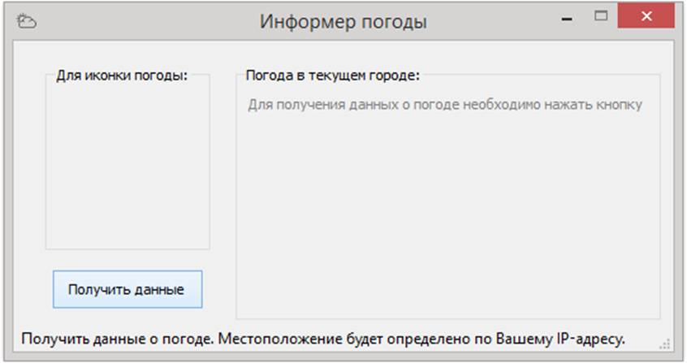
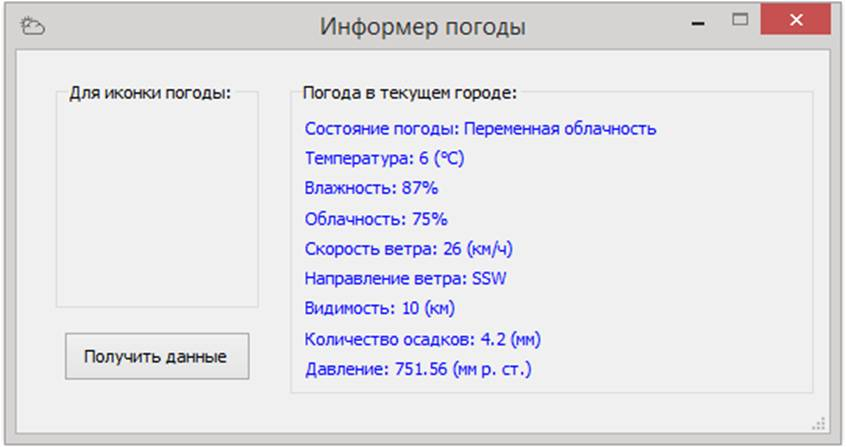
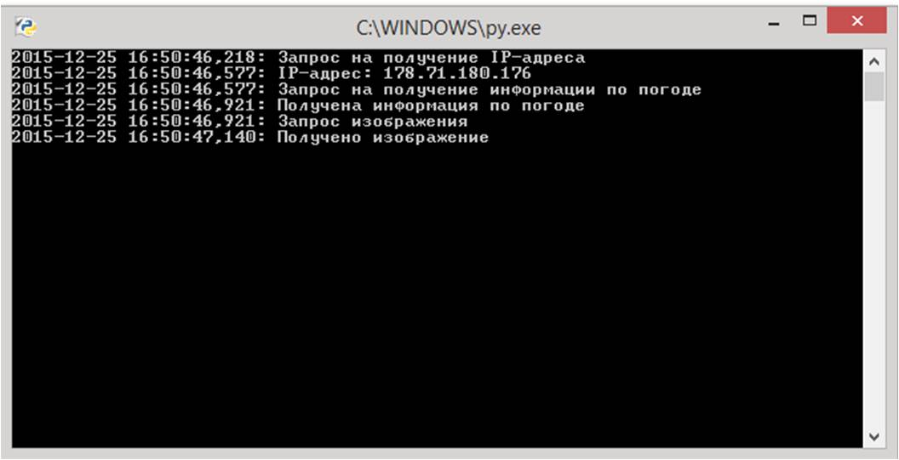

# weather_informer
Авторы: [Андрей Плешков](https://github.com/mz15), [Никита Бурков](https://github.com/become-iron)

**Информер погоды по IP-адресу определяет местоположение пользователя и получает текущие данные о погоде.**
IP-адрес определяется с помощью сервиса http://checkip.dyndns.org.
Данные о погоде предоставляет http://www.worldweatheronline.com/.

***Данные о погоде:***

* Состояние погоды
* Температура (°C)
* Облачность (%)
* Влажность (%)
* Видимость (км)
* Скорость ветра (км/ч)
* Направление ветра (16 вариантов)
* Количество осадков (мм)
* Давление (мм рт. ст.)

Также при каждом обновлении данных, скачивается картинка, соответствующая данной погоде.
Она сохраняется в той же директории (с заменой предыдущей). Отображение картинки в окне пока не реализовано.

***Пример работы программы:***

